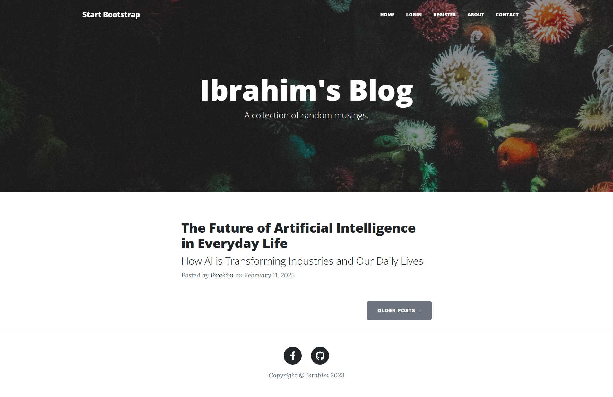

# Blog Website

A fully functional blog website built with Flask, HTML, CSS, and SQLite.


## Features
- User authentication (login/signup).
- Create, read, update, and delete (CRUD) blog posts.
- Responsive design for mobile and desktop.

## Technologies Used
- Flask (Python web framework)
- SQLite (Database)
- HTML, CSS, JavaScript (Frontend)
- Bootstrap (Styling)

## Installation
1. Clone the repository:
   ```bash
   git clone https://github.com/Ibrahim-devx/blog-website.git
